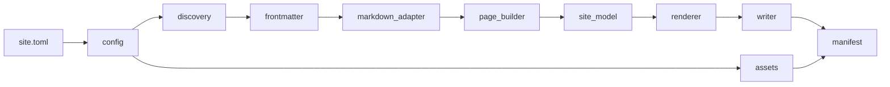

# Architecture 

This document describes the Static Site Generator pipeline, module boundaries, and
error-recovery behaviour. It complements the [ADRs](adr/) and the [project spec](spec/static_site_generator_improved_full_scope.txt).

## Pipeline overview



Stages run in order inside `SiteBuilder.build()`:

1. **Load config** — validate paths, permalink template, safe output directory.
2. **Clean output** — optional `dist/` wipe with containment checks.
3. **Discover** — walk `content/` for `.md` / `.markdown` files.
4. **Parse front matter** — line-oriented metadata parser with warnings for unknown fields.
5. **Convert Markdown** — `MarkdownConverter` (Python-Markdown, `extra` extension).
6. **Build pages** — derive slug, URL, layout, collection; warn on collection slug collisions.
7. **Filter drafts** — honour `include_drafts` from config or CLI.
8. **Validate layouts** — ensure each page’s layout file exists.
9. **Generate derived pages** — tag and collection index pages with shared URL registry.
10. **Build site model** — tags, collections, prev/next, navigation tree; reject duplicate URLs.
11. **Render** — apply layouts via `TemplateRenderer`; pre-render partials iteratively.
12. **Write HTML** — one `index.html` per URL under `output_dir`.
13. **Copy assets** — mirror `static/` into `dist/<assets_dir>/`.
14. **Write manifest** — `.ssg-manifest.json` with counters, warnings, errors, output list.

## Module responsibilities

| Module | Responsibility |
|--------|----------------|
| `config.py` | Load and validate `site.toml`; resolve paths relative to site root. |
| `discovery.py` | Find content files; skip hidden paths and non-Markdown files. |
| `frontmatter.py` | Parse supported metadata fields; warn on unknown keys. |
| `markdown_adapter.py` | Isolate Python-Markdown behind `MarkdownConverter`. |
| `page_builder.py` | Build `Page` models; URL/slug derivation; collection warnings. |
| `site_model.py` | Tag/collection grouping, generated pages, nav tree, `nav_html`. |
| `renderer.py` | Layout rendering, partial loading, template context assembly. |
| `template_adapter.py` | Minimal `{{ var }}`, ``, and `\| safe` support. |
| `writer.py` | Safe output cleaning and HTML writes with path containment. |
| `assets.py` | Copy static files into the output assets directory. |
| `manifest.py` | Serialize `BuildManifest` to JSON. |
| `builder.py` | Orchestrate the pipeline; continue-on-error aggregation. |
| `cli.py` | Argparse CLI: `build`, `clean`, `new`, `serve`. |
| `scaffold.py` | Create new content files for `ssg new`. |
| `errors.py` | Typed exception hierarchy with stage and path metadata. |
| `models.py` | Dataclasses: `SiteConfig`, `Page`, `SiteModel`, `BuildManifest`, etc. |

## Adapter boundaries

External capabilities sit behind adapters so the pipeline can be tested and swapped:

- **Markdown** — only `markdown_adapter.py` imports Python-Markdown.
- **Templates** — only `template_adapter.py` implements interpolation/conditionals.

See [ADR 0002](adr/0002-markdown-library-behind-adapter.md) and [ADR 0003](adr/0003-template-engine-through-adapter.md).

## Error recovery (`--continue-on-error`)

| Stage | Fatal (always aborts) | Recoverable with `--continue-on-error` |
|-------|----------------------|----------------------------------------|
| Config load | Yes | No |
| Discovery | Yes | No |
| Front matter / Markdown / page build | Per source file | Skip failed source; continue with others |
| Missing layout | Per page | Skip page; continue |
| Site model duplicate URL | Yes | Dedupe pages; retry; fallback to source-only model |
| Template render / write | Per page | Skip page; continue |
| Duplicate partial stem | Yes | Log error; render with empty partials |
| Asset copy | Yes | Log error; continue without assets |
| Manifest write | Yes | Log error; manifest may omit itself from `output_files` |

Non-page failures (assets, manifest) appear in `manifest.errors` but do not increment `pages_failed`.

## Library entry point

```python
from ssg import SiteBuilder

result = SiteBuilder("site.toml", continue_on_error=True).build()
print(result.manifest.pages_rendered, result.config.output_dir)
```

The CLI is a thin wrapper around `SiteBuilder` and `load_config`.
